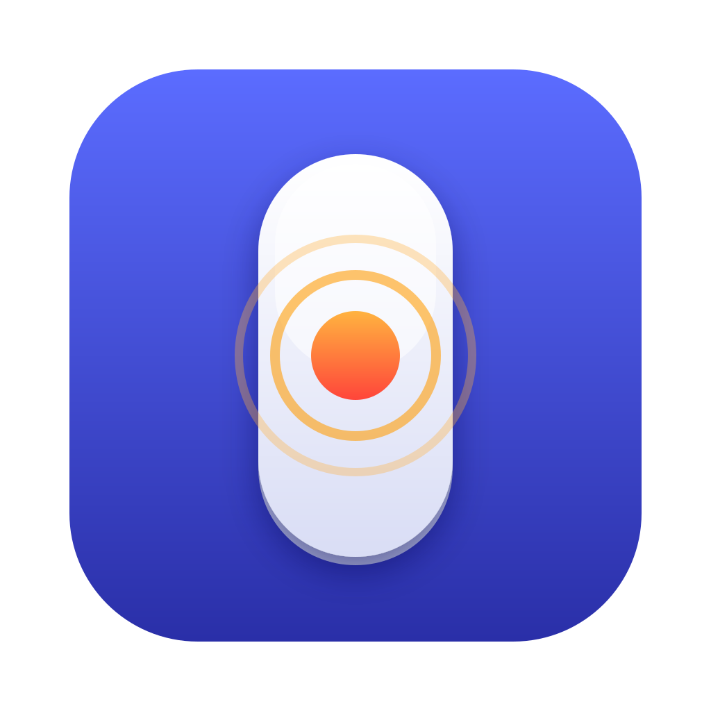

<p align="center"></p>

# MiddleTap

A tiny macOS menu bar app that turns a **Magic Mouse** (or trackpad) gesture into a **middle click**.

- Magic Mouse: click in the center, two/three finger click, or three finger tap
- Trackpad: three/four finger click or tap
- Optional fn-click, and optionally only active in selected apps
- Launch on login

## Install

1. Download `MiddleTap-1.0.0.zip` from the [latest release](https://github.com/dartoum/MiddleTap/releases/latest) and unzip it.
2. Move `MiddleTap.app` to `/Applications`.
3. The app is signed with a self-signed certificate and not notarized, so macOS blocks the first launch. Right-click the app, choose **Open**, then **Open** again (or allow it under *System Settings > Privacy & Security*).
4. Grant **Accessibility** access when asked (*System Settings > Privacy & Security > Accessibility*). Without it MiddleTap cannot send the middle click.

## Build from source

```bash
./build.sh
```

This produces `MiddleTap.app`. To keep the Accessibility permission across rebuilds, create a self-signed *Code Signing* certificate named `MiddleTap Dev` in Keychain Access; otherwise the build is signed ad-hoc and the permission resets on every rebuild.

## Notes

MiddleTap uses the private `MultitouchSupport` framework, the same approach as MiddleClick and BetterTouchTool. Private APIs can change with any macOS update.
